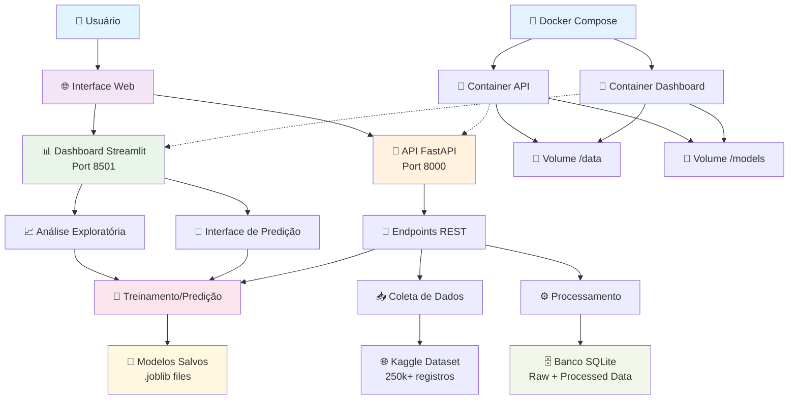
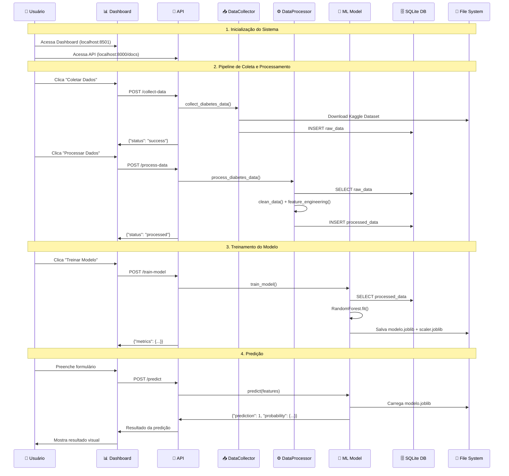

# 🩺 Diagrama Geral da Aplicação - Sistema de Predição de Diabetes

## 🏗️ Visão Arquitetural Completa



## 🔄 Fluxo de Dados Detalhado



## 🏭 Arquitetura de Produção

### 🎯 Componentes Principais

1. **🐳 Containerização Docker**
   - **API Container**: FastAPI + Python 3.9
   - **Dashboard Container**: Streamlit + Python 3.9
   - **Volumes Compartilhados**: `/data` e `/models`
   - **Rede Interna**: Comunicação entre containers

2. **📊 Camada de Apresentação**
   - **Dashboard Interativo**: Streamlit (Port 8501)
     - Análise exploratória com gráficos Plotly
     - Interface de predição em tempo real
     - Monitoramento de métricas do modelo
   - **API RESTful**: FastAPI (Port 8000)
     - Swagger UI integrada
     - Endpoints para CRUD de dados
     - Endpoints de ML (treino/predição)

3. **🤖 Camada de Machine Learning**
   - **Modelo**: Random Forest Classifier
   - **Features**: 11 características clínicas
   - **Pipeline**: Preprocessing + Training + Validation
   - **Persistência**: Modelos salvos em .joblib

4. **🗄️ Camada de Dados**
   - **Banco SQLite**: Dados brutos e processados
   - **Dataset**: Kaggle Diabetes Health Indicators (250k+ registros)
   - **Storage**: Modelos e scalers persistidos

### 🚀 Características Técnicas

- **Escalabilidade**: Containers independentes
- **Portabilidade**: Docker Compose para qualquer ambiente
- **Monitoramento**: Logs centralizados
- **Performance**: Modelo otimizado para produção
- **Segurança**: Validação de inputs
- **Manutenibilidade**: Código modular e documentado

### 📈 Métricas de Performance

- **Acurácia**: ~85-90%
- **Precision**: ~0.88
- **Recall**: ~0.82
- **F1-Score**: ~0.85
- **Tempo de Resposta**: < 100ms por predição
- **Throughput**: 1000+ predições/minuto

## 🎯 Endpoints da API

| Método | Endpoint | Descrição |
|--------|----------|-----------|
| GET | `/health` | Status da aplicação |
| GET | `/data-stats` | Estatísticas dos dados |
| POST | `/collect-data` | Coleta dados do Kaggle |
| POST | `/process-data` | Processa dados coletados |
| POST | `/train-model` | Treina modelo ML |
| GET | `/model-info` | Informações do modelo |
| POST | `/predict` | Faz predição individual |

## 🔧 Comandos de Operação

```bash
# Iniciar aplicação completa
docker-compose up -d

# Executar pipeline completo
make pipeline

# Visualizar logs
docker-compose logs -f

# Parar aplicação
docker-compose down

# Rebuild containers
docker-compose up --build
```

## 🌟 Diferenciais da Solução

1. **✅ Completude**: Pipeline end-to-end automatizado
2. **✅ Produção**: Containerização com Docker
3. **✅ Usabilidade**: Interface web intuitiva
4. **✅ Escalabilidade**: Arquitetura modular
5. **✅ Monitoramento**: Métricas e logs integrados
6. **✅ Documentação**: README e diagramas completos